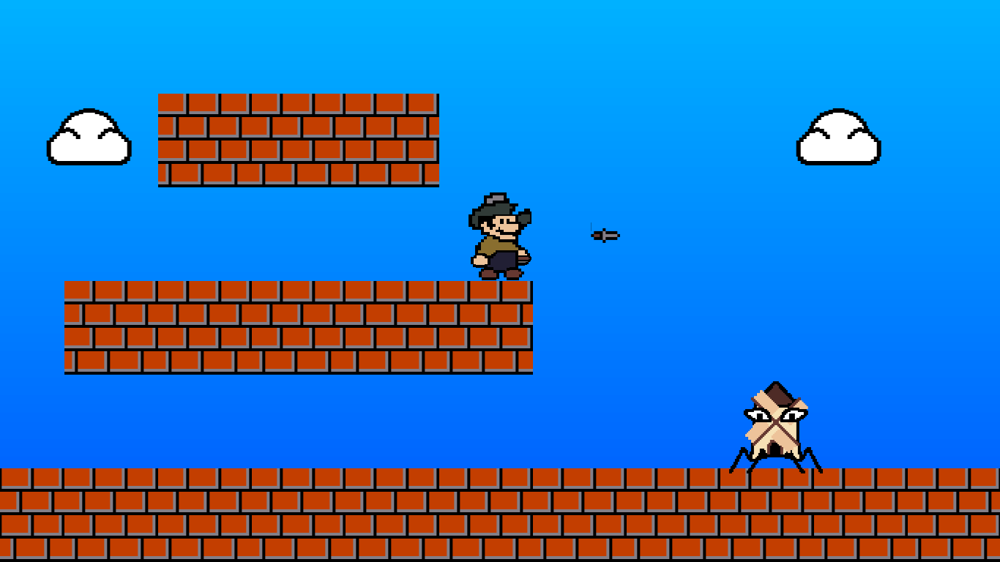

# Super Palo Bros

Jump game in Lua using the [LÖVE](https://love2d.org/) framework. Very much not finished.

Meant as a learning project. Art is, unfortunately, original

## Usage

Needs the [LÖVE](https://love2d.org/) framework.

Map is written in the map.txt file. # indicates a brick block. o indicates an enemy. $ indicates the player.

Run `love .` in the terminal.

## Progress status

### Done

- Read map from file
- General structure
- Player movement (walk, run, jump)
- Coyote time, Jump buffer
- Throwing knives
- Block destruction
- An enemy

### TODO

- More blocks
- Coins ?
- Parallax background
- More Enemies ?
- Particles when destroying blocks
