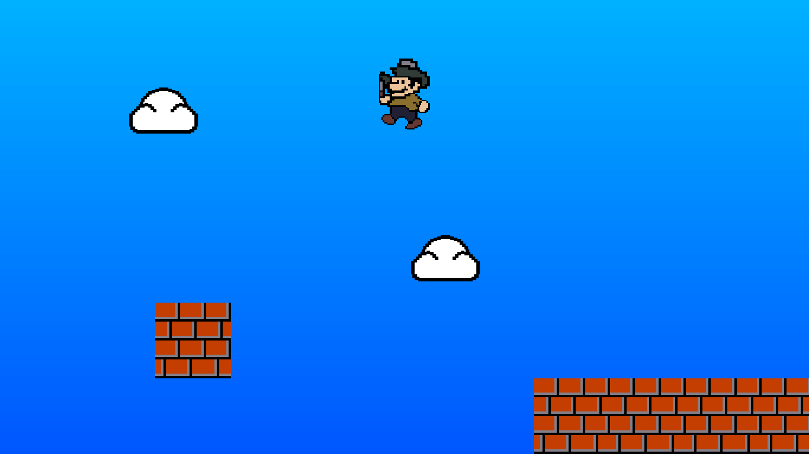

# Super Palo Bros

Jump game in Lua using the [LÖVE](https://love2d.org/) framework. Very much not finished.

Meant as a learning project. Art is, unfortunately, original

## Usage

Needs the [LÖVE](https://love2d.org/) framework.

Map is written in the map.txt file. # indicates a brick block.

Run `love .` in the terminal.

## Progress status

### Done

- Physics initialization
- General structure
- Player movement
- Provisional character skin
- Coyote time, Jump buffer
- Throwing

### TODO

- More blocks
- Some kind of score
- Parallax background
- Fix collisions
